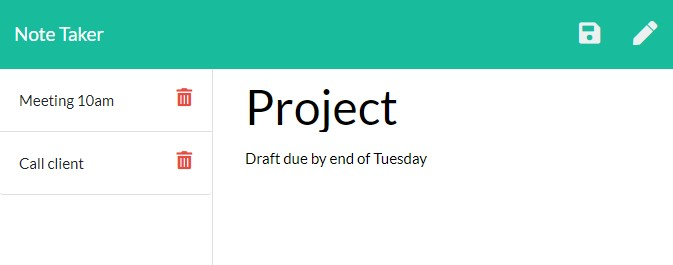

# Note Taker

## Description
The aim of this project was to modify a code for a note taking application that allows the user to write and save notes. The front end of the code was provided for this project, so it was completed all in the backend. The application works by using a JSON file to save and retrieve data from.  

## Table of Contents 

* [Installation](#installation)
* [Usage](#usage)
* [License](#License)
* [Contributing](#contributing)
* [Test](#test)
* [Questions](#questions)

## Installation
The technologies used for this project include Node.js, Epress.js, uniqid, JSON, JavaScript, HTML and CSS were all used to implement this project. . To use this project, Node, Express and uniqid will need to be installed.  

## Usage
The following screenshot shows an example of how the project looks when deployed. 

## License 
Permission is hereby granted, free of charge, to any person obtaining a copy of this software and associated documentation files(the "Software"), to deal in the Software without restriction, including without limitation the rights to use, copy, modify, merge, publish, distribute, sublicense, and / or sell copies of the Software, and to permit persons to whom the Software is furnished to do so, subject to the following conditions: The above copyright notice and this permission notice shall be included in all copies or substantial portions of the Software. THE SOFTWARE IS PROVIDED "AS IS", WITHOUT WARRANTY OF ANY KIND, EXPRESS OR IMPLIED, INCLUDING BUT NOT LIMITED TO THE WARRANTIES OF MERCHANTABILITY, FITNESS FOR A PARTICULAR PURPOSE AND NONINFRINGEMENT.IN NO EVENT SHALL THE AUTHORS OR COPYRIGHT HOLDERS BE LIABLE FOR ANY CLAIM, DAMAGES OR OTHER LIABILITY, WHETHER IN AN ACTION OF CONTRACT, TORT OR OTHERWISE, ARISING FROM, OUT OF OR IN CONNECTION WITH THE SOFTWARE OR THE USE OR OTHER DEALINGS IN THE SOFTWARE.

## Contributing
NA

## Test
No tests are currently available for this application

## Questions
If you have any questions or would like further information on this project, 
please contact silviataliana2@gmail.com or find me on [Github](https://github.com/silvia-taliana).